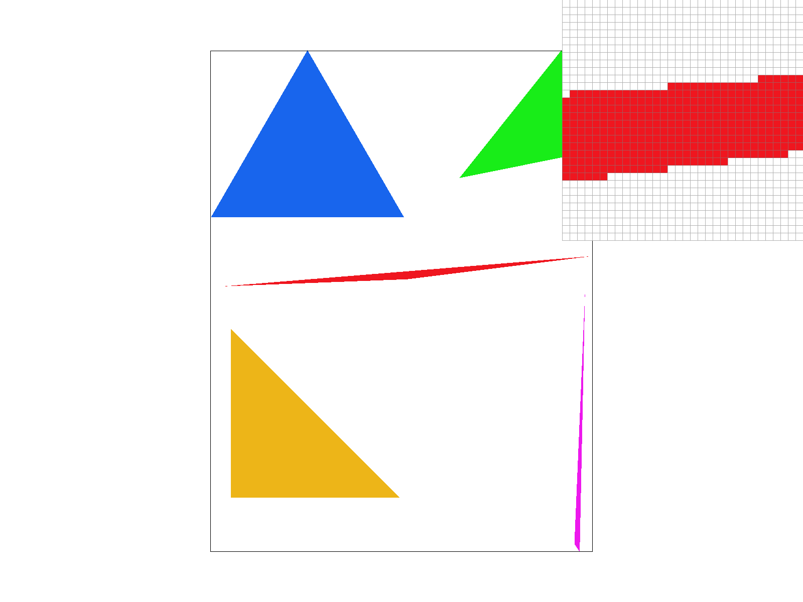
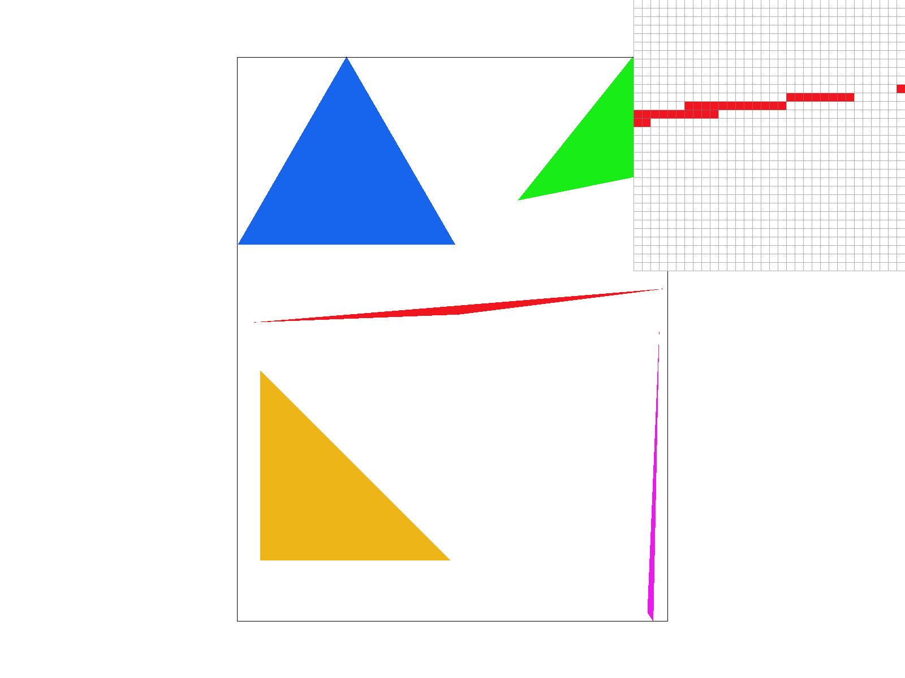
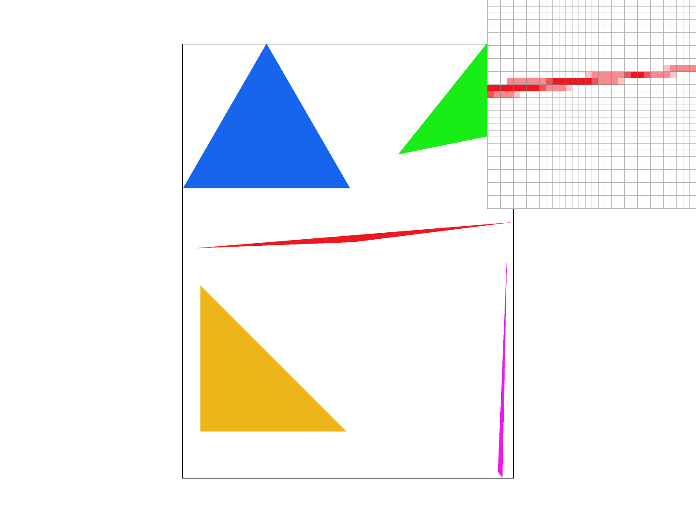
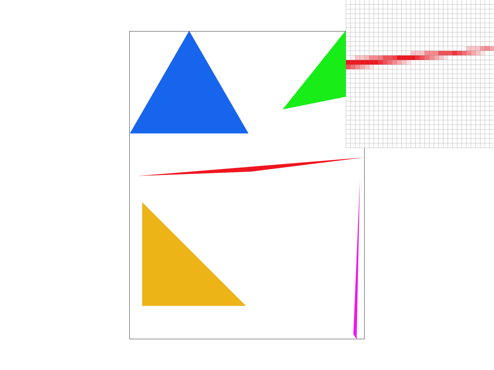
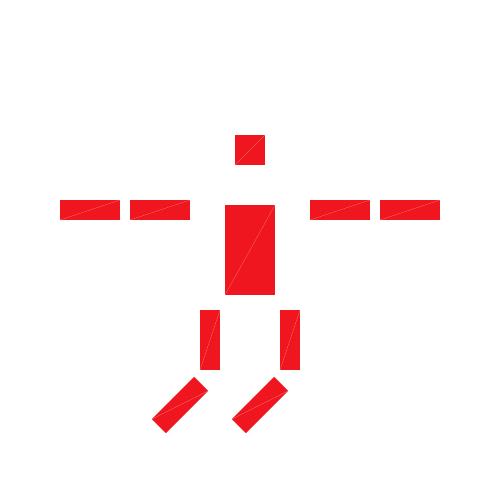
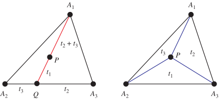
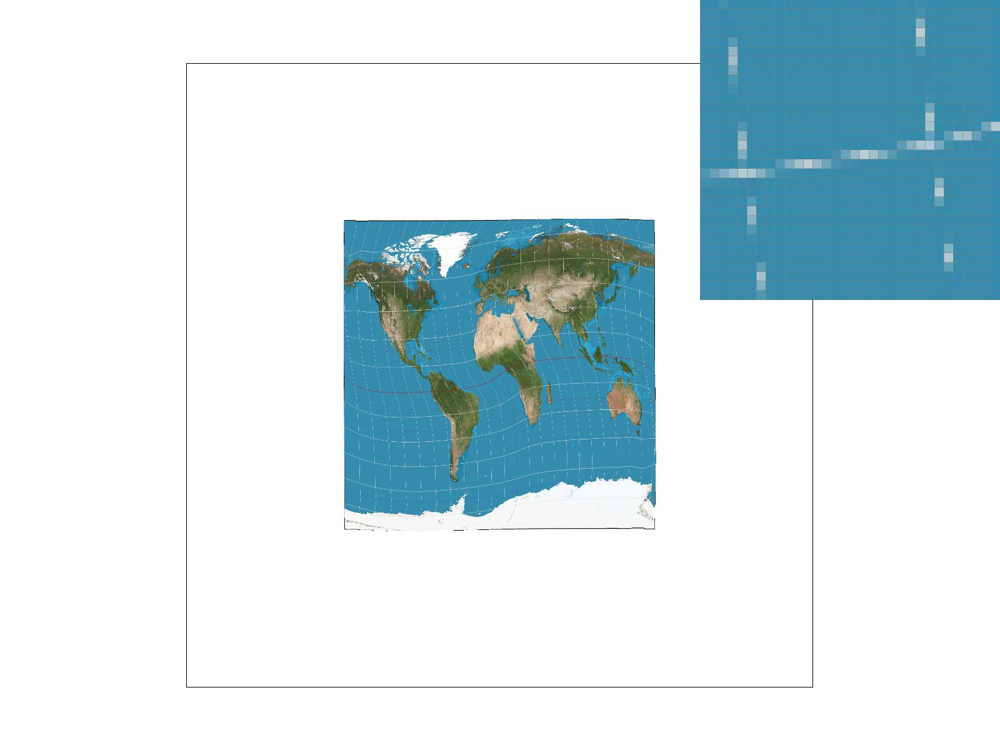
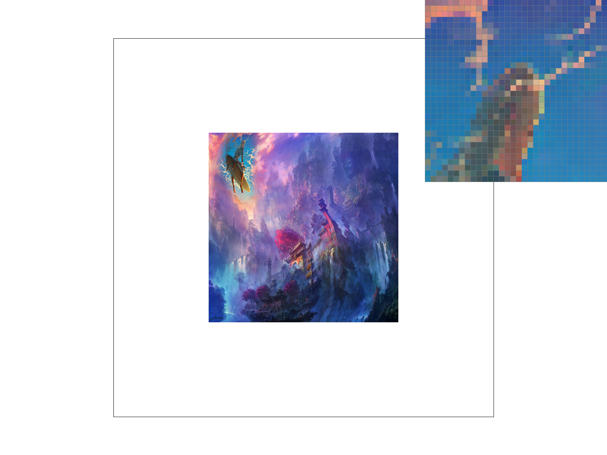
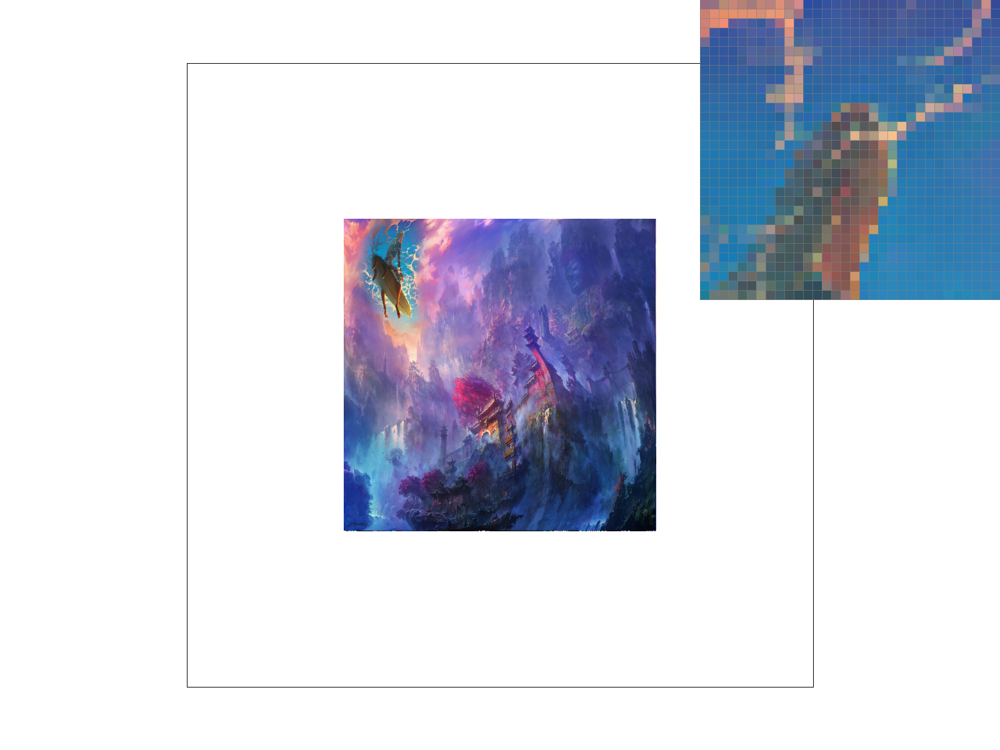

# Project 1

## Overview

In this project, we implemented rasterization in the 2D setting, implementing at least some of what is required of rendering SVG files that are comprised of monochromatic shapes and textured shapes.

## Task 1

### How it works:
1) Triangle rasterization works by first creating a bounding box around each shape that we will be rasterizing the triangle in.
	- I did this by taking the max and min of the x and y values of each vertex of the triangle and adding and subtracting one respectively just to be certain that we're including all of the pixels that we need to.
2) Then, we iterate through each pixel in the bounding box and check if the pixel is inside the triangle.
3) If it's inside the triangle, then we can add it to the sample buffer, and if not we do nothing.

### Efficiency
- It's literally just a bounding box around each triangle and then sampling each pixel in the box, so it's efficient

### Results

test4 image:

## Task 2

### How it works:
1) We do the exact same for loop as before, only now for each pixel we iterate over all the supersample locations too, nesting the for loop even further.
2) We simply extend the sample buffer (a vector) by the amount of extra samples we have to accomodate the extra samples we are doing, storing each sample in its own place
3) When we actually push the pixel to the screen, we take the average of all the samples in the sample buffer and push that to the screen buffer.

### Results

test4 image at 1, 4, 9, and 16 samples per pixel:

### Possible EC?:
- I was able to implement supersampling with constant memory overhead by adding fractional pixel values to what was in the sample buffer instead of adding the fractional pixel values at the end, but it had some undesireable properties that SVGs cannot have. I found that especially with the dragon SVG, certain triangles that needed to be rendered in order weren't overwriting each other like they needed to be. Instead we kept adding fractional pixel values which caused overflow issues.

## Task 3

- Here, I tried to make it look like the cube person tripped. I also tried to make their body a little thinner and their head a little better proportoned with the body. I did this through simple modifications to the scales, rotations and translations for the head, torso, and legs, making sure to change the ordering of the transforms as needed to accompliish this.

## Task 4

### Barycentric coordinates:

- Barycentric coordinates is a coordinate system based on the relative distances to each of the vertices of a triangle. An alternate (and more mathmatically accurate) description is the proportion of areas of the 3 sub-triangles you get when you connect a point inside a triangle to the vertices
- When you have the relative distances to each of the vertices (normalized so they add to one) to a point (say on a triangle we want to texture), you can look up the point on your texture (UV) triangle that corresponds to that point, and sample it for your texture
- We can do this easily becuase the barycentric weights of a point multiplied by the vertex coordinates will get us the point back again, so if we have the weights of a point in another triangle, we can map it onto a new triangle by weightinig the vertices of the new triangle by the barycentric weights

NOTE: make sure you aren't in dark mode when viewing the image below

### How it Works:
1) We still maintain all the supersampling for loops we had before. 
2) We calculate the barycentric coordinates (ie: the 3 vertex weights) for each point we (super)sample and use these as weights for each of the 3 vertex colors.
3) Add to buffer

### Results

test7 image

## Task 5

### How it Works:
We have 2 triangles -- one on the texture map and one in the image -- and one point in the image triangle that we would like to map to a point on our UV / texture triangle so we can sample
1) We calculate the barycentric coordinates of the (supersampled) point in the image triangle.
2) We multiply the barycentric coordinates by the vertex coordinates of the UV triangle to get the point in the UV triangle that corresponds to the point in the image triangle
3) We sample the texture at the point in the UV triangle we just calculated, using either nearest or bilinear sampling
3a) For bilinear sampling, we simply do 2 lerps based to neighboring pixels.

### Results

Here is the difference between nearest and bilinear sampling with no supersampling:

Bilinear is clearly better here

Here is the difference with 16 samples per pixel, still nearest and then bilinear:

Bilinear is clearly just smoother overall. In general, there is only a large difference when the texture map is at the same (or higher) resolution compared to the image in question... ie: for the bottom of the mip levels where we have highest res texture. It only really shows in high frequency bits of texture like this.

At high supersampling, bilinear isn't as clearly better, but it still seems to be slightly better with smoothness / color gradients.

## Task 6

### How it Works:

Most of the need for bilinear and supersampling comes from the fact that our sample pixels in the image space don't match the scale of the pixels in the texture space. This is especially true for the bottom of the mip levels where we have the highest resolution texture. To solve this, we can use MIP levels, which are precomputed versions of the texture at different resolutions. We can then use the MIP level that is closest to the scale of the image we are rendering to get the best possible texture quality

Implementation:
1) We calculate the uv coordinate to sample at same as in task 5. 
2) We can use the formula given in lecture for maximum ratio of uv pixel size to image pixel size to calculate the MIP level we should use
3) We then use the MIP level we calculated as the UV map used to sample the texture at the uv coordinate we calculated (scaled by the mip specific height and width).

### Tradeoffs:

Zero level and nearest should be about as fast, and if you only ever use the zeroth level, it saves you constant memory, but the quality won't be as good. For linear, it should run slower since you're effectively doing trilinear interpolation, but the quality will be better still with the same memory usage as nearest.

### Results

This is a fun image I have that I'm warping in the same way that the first map svg is warped.

This is the result of L_ZERO and P_NEAREST, L_ZERO and P_LINEAR, L_NEAREST and P_NEAREST, as well as L_NEAREST and P_LINEAR in order.

We can see that the first two (L_ZERO) have much rougher color gradients as a result of the fact that the underlying image has very high resolution, meaning mipmap zero does a poor job. That being said, bilinear interpolation helps a little with this harshness, but not much.

We can see that the second two (L_NEAREST) are about the same in terms of harshness, and maybe you could make an argument that the second is a bit better, but in my eyes they look about the same, showing that the mipmaps help quite a bit.